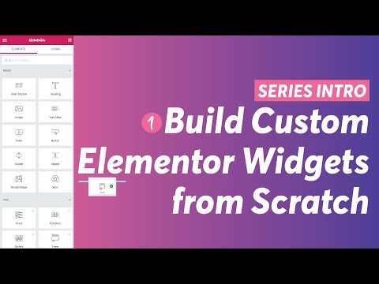

<link rel="stylesheet" href="messages.css">

| **Tutorial Name**    | **Build Custom Elementor Widgets from scratch [Playlist]** |
| -------------------- | ---------------------------------------------------------- |
| File Name            | README.md                                                  |
| Date Created         | 12/20/23                                                   |
| Date Modified        | --                                                         |
| Platform             | YouTube                                                    |
| Channel              | TechiePress                                      |
| Version              | 0.0.1                                                      |
| Programmer / Student | **Eric Hepperle**                                          |

* **Tutorial URL:** https://www.youtube.com/watch?v=4Ob-TFTnmP4&list=PLNqG1qGUllk2pukgHP385ll0ENmRr9E_M&index=1

### TECHNOLOGIES

  

## TAGS

`WordPress` `ACF` `Advanced Custom Fields` `Custom Post Types` `WP` `Post Meta` `Plugins` `Alecad`

## Purpose

**<u>Tutorial Work:</u>** Learn how to build a WordPress plugin from scratch with best practices and security measures.
    
## Requires

* WordPress installed
* Login to WordPress dashboard

### Description:

A multi-part tutorial playlist teaching how to create a WordPress plugin from scratch.

#### TIP: the settings.json in .vscode/ folder is key to getting the compile to work.

### Channel

<section class="author-profile">
  

    
  

  

    <h3><a href="https://www.youtube.com/@alecaddd" target="_blank">Alessandro Castellani</a></h3>
    <h4>Development, Design, Tech news, and other Nerdy stuff.</h4>
    
Tutorials and guides for Developers and Designers that want to learn HTML, CSS, JAVASCRIPT, PHP, WORDPRESS, GIT, LARAVEL, SQL, AWS, VUEJS, and how to bake a potato.

  

</section>
